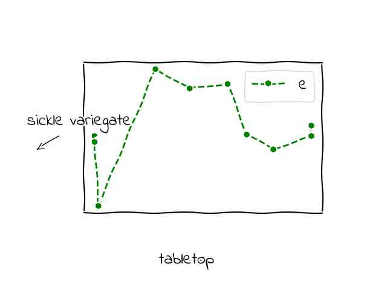
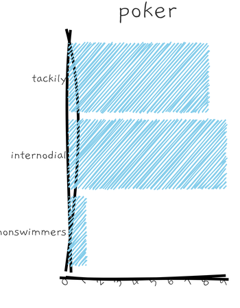
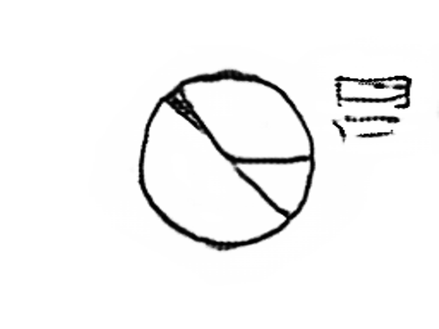

# Sketch2Vis
## Overview

This repository is an implementation of the paper accepted to ICMLA 2021, "Sketch2Vis: Generating Data Visualizations from Hand-drawn Sketches with Deep Learning".  
It presents a deep learning solution of translating human sketches into data visualization source code.

## Setup

### Environment
-   Create a conda environment with  `conda env create -f environment.yml -n sketch2vis`.
-   Activate the conda environment with  `conda activate sketch2vis`.

### Dataset

We used synthetic hand-drawn style data visualizations and  Domain Specific Language (DSL) for model training.
We provide 3 ways for dataset generations:

|Source | Current Supported Type | Examples |
| ---- |       ---   |    ---   |
| [MatPlotLib](https://matplotlib.org/stable/index.html)| Bar, Line, Scatte, Pie, Box|  

|
| [roughViz.js](https://github.com/jwilber/roughViz) | Bar, Line, Pie, Scat |  

  | 
| [Photo-Sketching](https://github.com/mtli/PhotoSketch)| Bar, Line, Scatte, Pie, Box|  

  |

### Sketch2Vis DSL 

The detailed Sketch2Vis DSL grammar can be checked in this [Notebook](./doc/Sketch2VisDSLGrammar.pdf).

#### Generate Dataset
1. MatPlotLib

Run `python generate_data.py --task create --plot_source xkcd --output_dir raw_data --plot_number $number$`

2. Photo-Sketching

Run ``python generate_data.py --task create --plot_source transfer --output_dir raw_data --plot_number $number$``,
Then Download pre-trained PhotoSketch models and save them into `checkpoints/PhotoSketch/pretrained`. 
Then run `git submodule update --init` and `./transfer_style.sh`

3. roughViz.js

We currently only provide pre-generated roughViz.js images. 

4. Merge Records

Run `python generate_data.py --task merge --output_dir raw_data`

### Data Preprocess

Run `python preprocess.py` and `./preprocess.sh`

## Train
The implementation of Transformer-Based model, which translates the sketch into DSL code is updated based on [fairseq-image-captioning](https://github.com/krasserm/fairseq-image-captioning)

Run `./train.sh`

## Inference

Run `./inference.sh`

## Evalution

Run `python eval.py`

## Cite Our Paper

If you like our work, please consider citing:

@inproceedings{teng2021sketch2vis,
title={Sketch2Vis: Generating Data Visualizations from Hand-drawn Sketches with Deep Learning},
author={Teng, Zhongwei and Fu, Quchen and White, Jules and Schmidt, Douglas C},
booktitle={2021 20th IEEE International Conference on Machine Learning and Applications (ICMLA)},
pages={853--858},
year={2021},
organization={IEEE}
}
